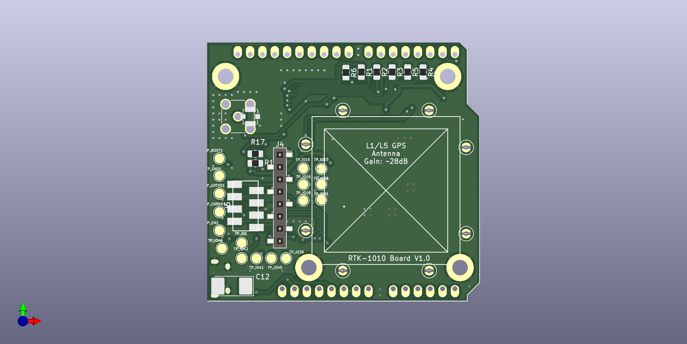

# RTK1010Board

Arduino Compatible RTK1010 Board/PCB

**:exclamation: Design not finished yet :exclamation:**

### Features:

- Arduino compatibe form factor
- RTK1010 GPS receiver
- IPEX connector for onboard antennas
- backup battery
- optional SMA connector for external antennas
- optional LDO for LNA power supply
- optional ESP32-S2 for operating as base station
- optional power via USB
- optional IMU (BNO055)

### Use Cases:

#### A) Minimum RTK-1010 receiver with arduino form factor

  - RTK-1010 <-> RX/TX arduino pins
  - SMA or IPEX connector
  - LNA power by RTK-1010 (max 30mA)
  - RTK-1010 backup battery
  - *(optional)* LNA LDO (max 250mA)

#### B) Minimum RTK base station with RTK-1010 & ESP32-S2 powered by USB

  - ESP32: RTK <=> TCP bridge
  - powered by USB
  - SMA or IPEX connector
  - LNA power
  - RTK-1010 backup battery
  - *(optional)* LNA LDO (max 250mA)

#### C) Mowgli HEAD with RTK-1010, ESP32-S2 and IMU - *(TODO)*

  - ESP32: running microROS
  - VCC, GND, UART interface to YF mainboard
  - low power, sleep mode

---

[Build Manual](BuildManual.pdf)

For the [BOM](bom/README.md) take a look at the [bom folder](bom/) - *there is also an [iBOM](bom/ibom.html) available*

[RTK 1010 datasheet](https://www.locosystech.com/Templates/att/RTK-1010_datasheet_v0.7.pdf)

[Schematic](kicad/RTK1010Board.pdf)

